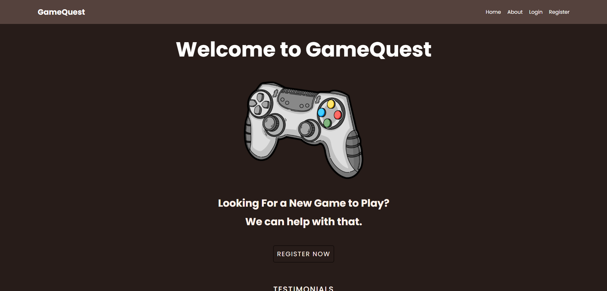
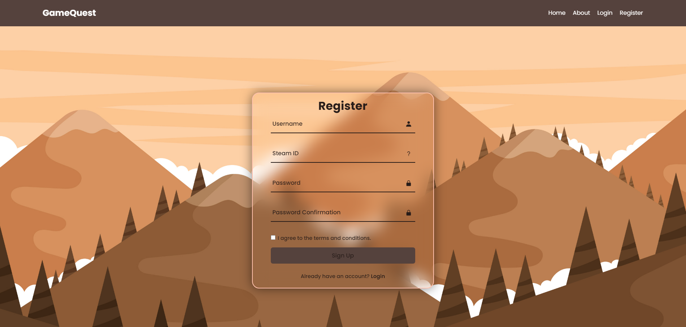
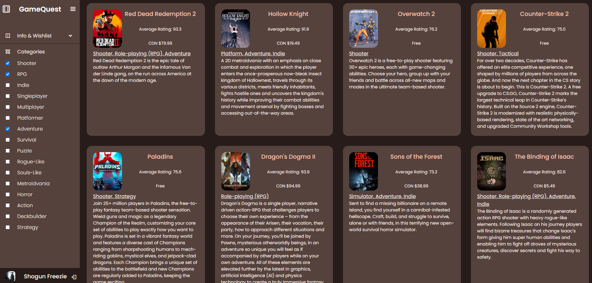

# GameQuest
---
This project is an on-going development for a game recommendation system utilizing user's online game platform account information such as Steam. As long as your profile is public, our website will utilize your game library information and recent playtime to recommend you games perfectly tailoroed to your tastes.
In case you are looking for something more specific, use our genre tags in order to control exactly what you want to see and play.

## Features

- [Steam API](https://developer.valvesoftware.com/wiki/Steam_Web_API#GetPlayerSummaries_.28v0001.29) integration for retrieving user's Steam profile.
- [IGDB](https://api-docs.igdb.com/) Integration using [PHP Wrapper](http://enisz.github.io/igdb). This is specifically used for locating games users may be interested in.
- If you find a game you are interested in, feel free to wishlist it and you will always be able to come back to it. Be sure to remember your login information!

## Screenshots





## Tech Stack

**Client:** HTML/CSS, JavaScript
**Extras:** JQuery, Steam API, IGDB
**Server:** PHP

## Run Locally

Clone the project

```bash
  git clone https://github.com/j-muell/game-recommendation-app.git
```

## Project Structure

The root folder of GameQuest holds 7 main directories

- Components
  - This directory is designed to have every visual element you can see on our website.
  - Whether it is from the gameSite or the landing page, it exists within this directory and potential subdirectories.
- Extras
  - Anything extra that is unrelated to the main app, such as SQL Queries for our database.
- Functions
  - This directory is designed to have any files that are purely including for function purposes.
  - For example, our SteamAPI Wrapper that was overhauled by our team, or the IGDB PHP Wrapper. Both are linked above in the readme.
- Images
- Includes
  - Includes is dedicated to specifically backend/server php files, and generally anything to do with databse work. It also utilizing the functions directory files.
- Scripts
  - This directory is for most of the javascript in our application, aside from some minor in-line javascript.
- Styles
  - Any stylesheets in our application.

 If you have any questions please contact me.

 @2024
